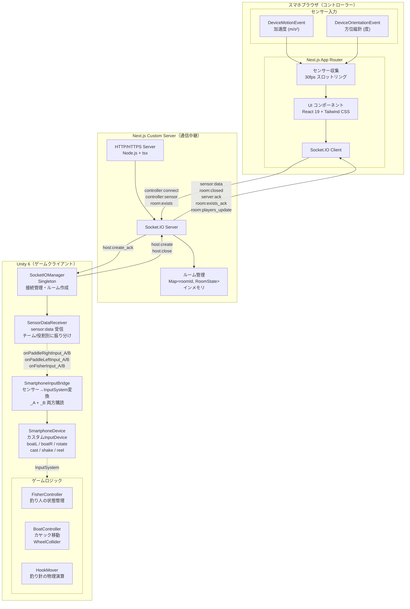
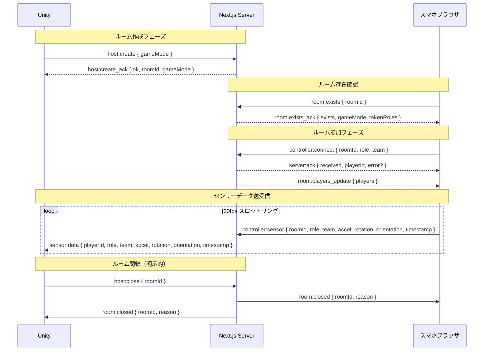

# 03_Architecture

## システムアーキテクチャ



### 通信フロー



## Socket.IO イベント設計

### ホスト（Unity）用イベント

| イベント名 | 方向 | データ |
|---|---|---|
| `host:create` | Unity → サーバー | `{ gameMode?: "single" \| "versus" }` |
| `host:create_ack` | サーバー → Unity | `{ ok: boolean, roomId?: string, gameMode?: string, error?: string }` |
| `host:close` | Unity → サーバー | `{ roomId: string }` |

### コントローラー（スマホ）用イベント

| イベント名 | 方向 | データ |
|---|---|---|
| `room:exists` | スマホ → サーバー | `{ roomId: string }` |
| `room:exists_ack` | サーバー → スマホ | `{ exists: boolean, gameMode?: string, takenRoles?: Record<string, string[]> }` |
| `controller:connect` | スマホ → サーバー | `{ roomId: string, role: string, team: string }` |
| `server:ack` | サーバー → スマホ | `{ received: boolean, playerId?: string, error?: string }` |
| `controller:sensor` | スマホ → サーバー | `{ roomId, role, team, accel, rotation, orientation, timestamp }` |

### 共通イベント

| イベント名 | 方向 | データ |
|---|---|---|
| `sensor:data` | サーバー → Unity | `{ playerId, role, team, accel, rotation, orientation, timestamp }` |
| `room:closed` | サーバー → スマホ/Unity | `{ roomId: string, reason: string }` |
| `room:players_update` | サーバー → スマホ/Unity | `{ players: { playerId, role, team }[] }` |

### ルーム管理

- サーバーが `Map<string, RoomState>` でアクティブルームをインメモリ管理
- ルームIDはサーバー側で採番（6文字英数字、I/O/0/1除外）
- ホスト（Unity）切断時に自動でルーム削除
- 各役割は1つのデバイスのみ占有可能（**同一チーム内**で重複接続不可）
- プレイヤー切断時に役割が自動解放される
- ゲームモード: `single`（1チーム3人）、`versus`（2チーム3vs3）

### 役割（role）の種類

| role | 操作 | 使用センサー |
|------|------|-------------|
| `paddle_right` | 右オール（スマホを振る） | DeviceMotionEvent（加速度） |
| `paddle_left` | 左オール（スマホを振る） | DeviceMotionEvent（加速度） |
| `fisher` | 釣り（方位磁針で狙い → キャスト → 引き上げ） | DeviceOrientationEvent + DeviceMotionEvent |

### チーム（team）

| team | 説明 |
|------|------|
| `A` | チームA（singleモードでは全員がチームA） |
| `B` | チームB（versusモードのみ） |

---

## Unity側データフロー

```
SocketIOManager (Singleton)
  └── サーバー接続・ルーム作成/閉鎖
  └── sensor:data 受信 → SensorDataReceiver.OnSensorData

SensorDataReceiver
  └── チーム別イベント発火
  │   ├── onTeamASensorData
  │   └── onTeamBSensorData
  └── 役割別イベント発火
      ├── onPaddleRightInput_A / onPaddleRightInput_B
      ├── onPaddleLeftInput_A / onPaddleLeftInput_B
      └── onFisherInput_A / onFisherInput_B

SmartphoneInputBridge（_A + _B 両方購読）
  └── 加速度 → Paddle推進力（9.8 m/s² で最大1.0）
  └── 方位角 + 角速度 → Fisher操作
  └── InputSystem.QueueStateEvent → SmartphoneDevice

SmartphoneDevice（カスタム InputDevice）
  └── boatL / boatR（左/右オール推進力 0〜1）
  └── rotate（釣り人の向き -1〜1）
  └── cast（キャスト強度 0〜1）
  └── shake（シェイク強度 0〜1）
  └── reel（リール強度 0〜1）
```

singleモードでは全員が `team: "A"` として送信するため `_A` イベントのみ使用される。

---

## 主要クラス一覧

### Unity (Assets/)

| クラス名 | パス | 役割 |
|---------|------|------|
| `SocketIOManager` | `rita/Scripts/` | Socket.IO接続管理（Singleton）。ルーム作成・閉鎖 |
| `SensorDataReceiver` | `rita/Scripts/` | `sensor:data` 受信、チーム/役割別にUnityEvent発火 |
| `SensorDataModels` | `rita/Scripts/` | データモデル定義（`SensorDataPayload`、`AxisData`） |
| `SmartphoneInputBridge` | `soma/Scripts/` | SensorDataReceiverのイベントをInputSystemに変換（`_A`+`_B`購読） |
| `SmartphoneDevice` | `soma/Scripts/` | スマホセンサー用カスタムInputDevice |
| `SmartphoneDeviceState` | `soma/Scripts/` | SmartphoneDeviceの入力状態ストラクト |
| `QRCodeDisplay` | `rita/Scripts/QR/` | ルームIDのQRコードをUIに表示（MonoBehaviour） |
| `QRCodeGenerator` | `rita/Scripts/QR/` | 文字列からQRコード `Texture2D` を生成（static） |
| `QREncoder` | `rita/Scripts/QR/` | QRコードエンコード（UniQRCode） |
| `FisherController` | `soma/Scripts/Fisher/` | 釣り人の状態管理・入力処理 |
| `HookMover` | `soma/Scripts/Fisher/` | 釣り針の物理演算・浮力・水中抵抗制御 |
| `Hook` | `soma/Scripts/Fisher/` | 釣り針の当たり判定 |
| `Fish` | `soma/Scripts/Fisher/` | 魚の挙動制御 |
| `BoatController` | `chebuo/Scripts/` | カヤック移動（WheelCollider ベース） |
| `KayakRiderHealth` | `soma/Scripts/` | カヤックのHP管理 |
| `IDamageable` | `soma/Scripts/` | ダメージインターフェース |
| `OarAnimSetter` | `soma/Scripts/` | オールのアニメーション制御 |
| `FishRumble` | `soma/Scripts/Fisher/` | 魚ヒット時の振動制御 |
| `paddle_example` | `rita/Scripts/forDebug/` | デバッグ用：オール入力でRigidbodyに力を加える |
| `fisher_example` | `rita/Scripts/forDebug/` | デバッグ用：釣り入力をTransform回転に反映 |
| `SensorDebug` | `rita/Scripts/forDebug/` | デバッグ用：受信データをコンソールに表示 |

### コントローラー (controller/)

| ファイル | パス | 役割 |
|---------|------|------|
| `server/index.ts` | `server/` | カスタムサーバー（Socket.IO統合、ルーム管理、HTTPS対応） |
| `page.tsx` | `src/app/page.tsx` | ルームID入力画面 |
| `page.tsx` | `src/app/room/[roomId]/page.tsx` | コントローラー画面（チーム選択→役割選択→センサー送信） |
| `PermissionRequest.tsx` | `src/components/` | iOSセンサー権限リクエストUI |
| `RoleSelector.tsx` | `src/components/` | 役割選択UI（チーム対応） |
| `TeamSelector.tsx` | `src/components/` | チーム選択UI（versusモード用） |
| `SensorDisplay.tsx` | `src/components/` | センサー値リアルタイム表示 |
| `SensorDebugOverlay.tsx` | `src/components/` | デバッグオーバーレイ |
| `useDeviceMotion.ts` | `src/hooks/` | センサーデータ取得・スロットル |
| `useSocket.ts` | `src/hooks/` | Socket.IO接続管理・センサーデータ送信 |
| `types.ts` | `src/lib/` | 型定義（`Team`, `PlayerRole`, `GameMode`, `SensorPayload` など） |

