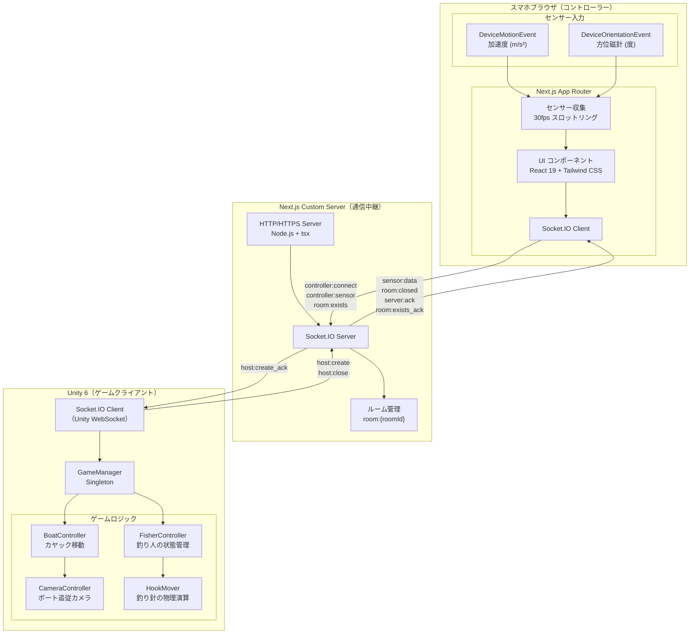
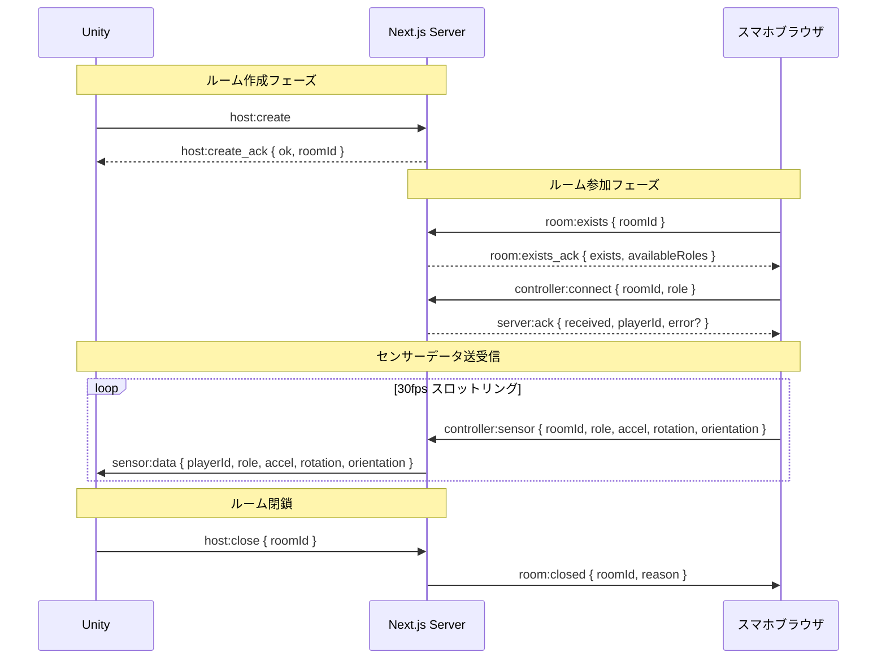

# 03_Architecture (クラス構造・タスク分割)

## 0. システムアーキテクチャ

### 通信フロー

### Socket.IO イベント設計

#### ホスト（Unity）用イベント

| イベント名 | 方向 | データ |
|---|---|---|
| `host:create` | Unity → サーバー | `{}` |
| `host:create_ack` | サーバー → Unity | `{ ok: boolean, roomId?: string, error?: string }` |
| `host:close` | Unity → サーバー | `{ roomId: string }` |

#### コントローラー（スマホ）用イベント

| イベント名 | 方向 | データ |
|---|---|---|
| `room:exists` | スマホ → サーバー | `{ roomId: string }` |
| `room:exists_ack` | サーバー → スマホ | `{ exists: boolean, availableRoles?: string[] }` |
| `controller:connect` | スマホ → サーバー | `{ roomId: string, role: string }` |
| `server:ack` | サーバー → スマホ | `{ received: boolean, playerId?: string, error?: string }` |
| `controller:sensor` | スマホ → サーバー | `{ roomId, role, accel, rotation, orientation, timestamp }` |

#### 共通イベント

| イベント名 | 方向 | データ |
|---|---|---|
| `sensor:data` | サーバー → Unity | `{ playerId, role, accel, rotation, orientation, timestamp }` |
| `room:closed` | サーバー → スマホ | `{ roomId: string, reason: string }` |

#### ルーム管理

- サーバーが `Map<string, RoomState>` でアクティブルームをインメモリ管理
- ルームIDはサーバー側で採番（6文字英数字、I/O/0/1除外、30⁶通り）
- ホスト（Unity）切断時に自動でルーム削除
- 存在しないルームへの接続は `server:ack { received: false }` で拒否
- 各役割は1つのデバイスのみ占有可能（同一ルーム内で重複接続不可）
- プレイヤー切断時に役割が自動解放される

### 役割（role）の種類

| role | 操作 | 使用センサー |
|------|------|-------------|
| `paddle_right` | 右オール（スマホを振る） | DeviceMotionEvent（加速度） |
| `paddle_left` | 左オール（スマホを振る） | DeviceMotionEvent（加速度） |
| `fisher` | 釣り（方位磁針で狙い → キャスト → 引き上げ） | DeviceOrientationEvent + DeviceMotionEvent |

---

## 1. マイルストーンとタスク分け

### 【MVP】(最小限のプロダクト)

#### 釣り攻撃（担当: そーま）
* 釣り針に魚アイテムがヒットしたときの判定 ([#3](https://github.com/guriguri00451/alounity/issues/3))
* Swinging状態での振り回し攻撃判定 ([#4](https://github.com/guriguri00451/alounity/issues/4))
* 魚アイテムのプレハブ作成 ([#5](https://github.com/guriguri00451/alounity/issues/5))
* MakeFisher ブランチを dev にマージ ([#6](https://github.com/guriguri00451/alounity/issues/6))

#### スマホ操作（担当: リタ）
* スマホ→Unity 間の通信方式を技術選定・設計 ([#7](https://github.com/guriguri00451/alounity/issues/7))
* スマホ側で加速度センサーを取得 ([#8](https://github.com/guriguri00451/alounity/issues/8))
* スマホ側で方位磁針（方角）を取得 ([#9](https://github.com/guriguri00451/alounity/issues/9))
* Unity 側でスマホ入力を受信 ([#10](https://github.com/guriguri00451/alounity/issues/10))
* 釣りアクションとオール操作をスマホ入力にマッピング ([#11](https://github.com/guriguri00451/alounity/issues/11))

#### カヤック移動（担当: Chebuo）
* kayakMove ブランチを dev にマージ ([#12](https://github.com/guriguri00451/alounity/issues/12))

#### ステージ（担当: 未定）
* 簡易ステージ（Plane + 障害物）の作成 ([#13](https://github.com/guriguri00451/alounity/issues/13))

---

### 【ハッカソン目標】

#### QRマッチング基盤
* Unity 側でQRコードを生成・表示 ([#14](https://github.com/guriguri00451/alounity/issues/14))
* スマホアプリ側でQRコードを読み取り ([#15](https://github.com/guriguri00451/alounity/issues/15))
* QRスキャン後にスマホ→Unity へ接続・入力送信を開始 ([#16](https://github.com/guriguri00451/alounity/issues/16))

#### マルチプレイ・ゲームループ
* 2チームのプレイヤー管理・ロール割り当て ([#17](https://github.com/guriguri00451/alounity/issues/17))
* ゲームUI（HP・スコア・タイマー） ([#18](https://github.com/guriguri00451/alounity/issues/18))
* 2チームプレイのゲームループ（勝敗判定・終了処理） ([#19](https://github.com/guriguri00451/alounity/issues/19))
* ゲームリセット・再スタート機能 ([#20](https://github.com/guriguri00451/alounity/issues/20))

#### ビジュアル・演出
* カヤック内に人モデルを配置 ([#21](https://github.com/guriguri00451/alounity/issues/21))
* ラグドールを使った人モデルの動き（漕ぎ・釣り） ([#22](https://github.com/guriguri00451/alounity/issues/22))
* ダメージを受けたときのヒットエフェクト ([#23](https://github.com/guriguri00451/alounity/issues/23))
* 魚アイテムの種類を追加（速度バフ系など） ([#24](https://github.com/guriguri00451/alounity/issues/24))
* 海のテクスチャ/Shader ([#25](https://github.com/guriguri00451/alounity/issues/25))

---

### 【ベスト目標】
* 4チームプレイへの拡張。
* しっかりとしたステージの作成。

---

## 2. 主要クラス一覧

| クラス名 | パス | 役割 |
|---------|------|------|
| `SocketIOManager` | `contributors/rita/Scripts/` | Socket.IO接続管理（Singleton）。ルーム作成・閉鎖、センサーデータ受信 |
| `QRCodeDisplay` | `contributors/rita/Scripts/QR/` | ルームIDのQRコードをUIに表示（MonoBehaviour） |
| `QRCodeGenerator` | `contributors/rita/Scripts/QR/` | 文字列からQRコード `Texture2D` を生成（static） |
| `FisherController` | `contributors/soma/Scripts/` | 釣り人の状態管理・入力処理（Idle → Waiting → Catching → Swinging） |
| `HookMover` | `contributors/soma/Scripts/` | 釣り針の物理演算・浮力・水中抵抗制御 |
| `BoatController` | `contributors/chebuo/Scripts/` | カヤック移動（WheelCollider ベース） |
| `CameraController` | `contributors/chebuo/Scripts/` | ボート追従カメラ（SmoothDamp） |
| `GameManager` | `Scripts/`（新規予定） | Singleton。ゲーム状態管理・チーム管理 |

> 現時点で実装済みのものを記載。未実装のクラスは各 Issue を参照してください。
