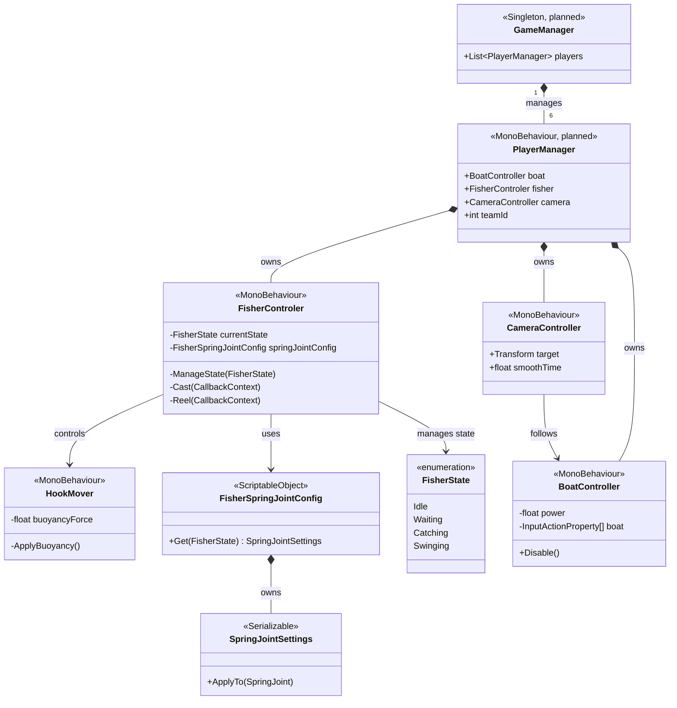
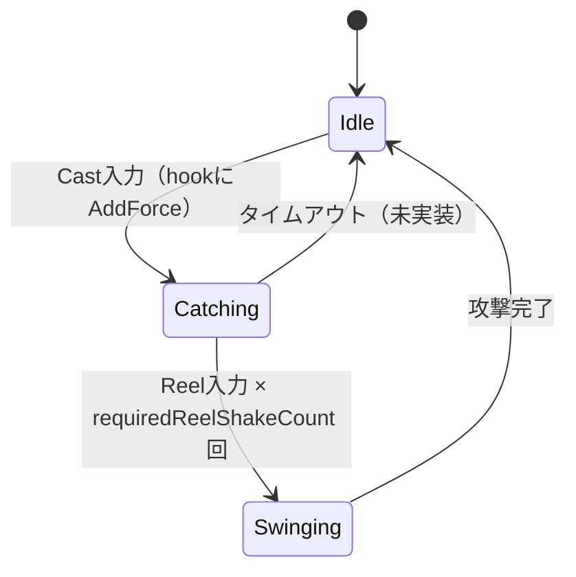

# 04_ClassDiagram (クラス図)

## 1. 全体クラス図

> `<<planned>>` は未実装。それ以外は実装済み。

---

## 2. 釣り機能 ステートマシン

> `FisherControler.ManageState()` で遷移。`Cast()` / `Reel()` が入力トリガー。

---

## 3. 凡例

| 記法 | 意味 |
|------|------|
| `<<planned>>` | 未実装クラス（対応 Issue を参照） |
| `<<Singleton>>` | インスタンスが1つのみ |
| `<<enumeration>>` | enum 型 |
| `<<ScriptableObject>>` | Unity ScriptableObject（アセットとして保存） |
| `<<Serializable>>` | Inspector/JSON シリアライズ可能な純粋クラス |
| `-->` | 依存（参照するが所有しない） |
| `*--` | コンポジション（ライフサイクルを共にする） |
| `-` prefix | private メンバ |
| `+` prefix | public メンバ |
| `$` suffix | static メンバ |
