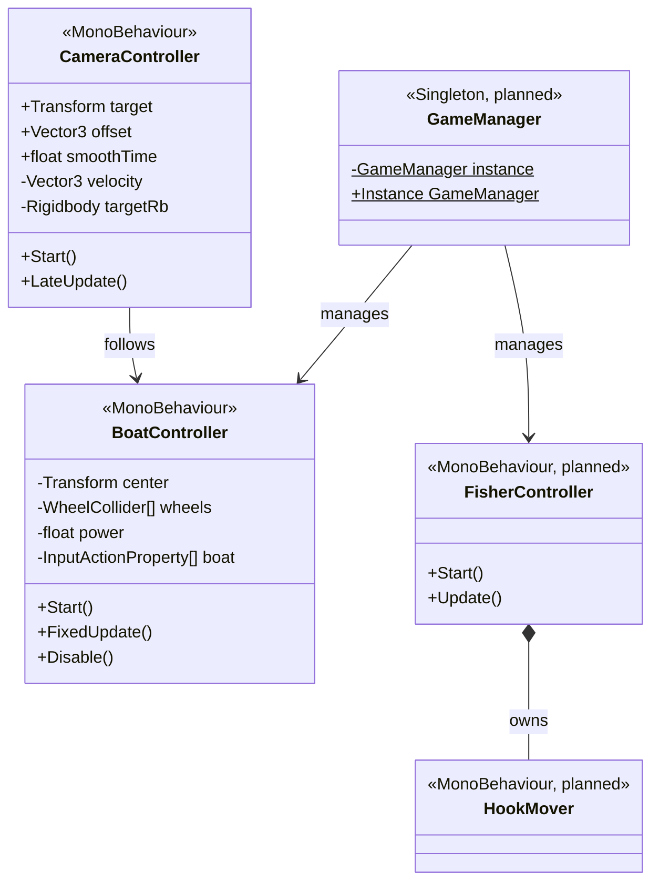
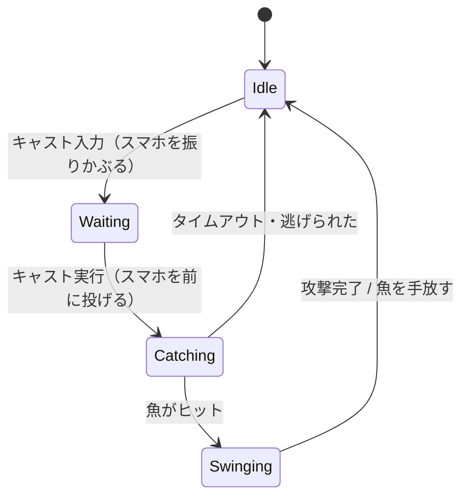

# 04_ClassDiagram (クラス図)

## 1. 全体クラス図

> `<<planned>>` は未実装（対応 Issue 参照）。矢印の意味は§3 凡例を参照。

---

## 2. 釣り機能 ステートマシン

> `FisherController` の状態遷移（[Issue #3](https://github.com/guriguri00451/alounity/issues/3), [#4](https://github.com/guriguri00451/alounity/issues/4) で実装予定）

---

## 3. 凡例

| 記法 | 意味 |
|------|------|
| `<<planned>>` | 未実装クラス（対応 Issue を参照） |
| `<<Singleton>>` | インスタンスが1つのみ（GameManager） |
| `-->` | 依存（参照するが所有しない） |
| `*--` | コンポジション（ライフサイクルを共にする） |
| `o--` | 集約（独立して存在できる） |
| `-` prefix | private メンバ |
| `+` prefix | public メンバ |
| `$` suffix | static メンバ |
