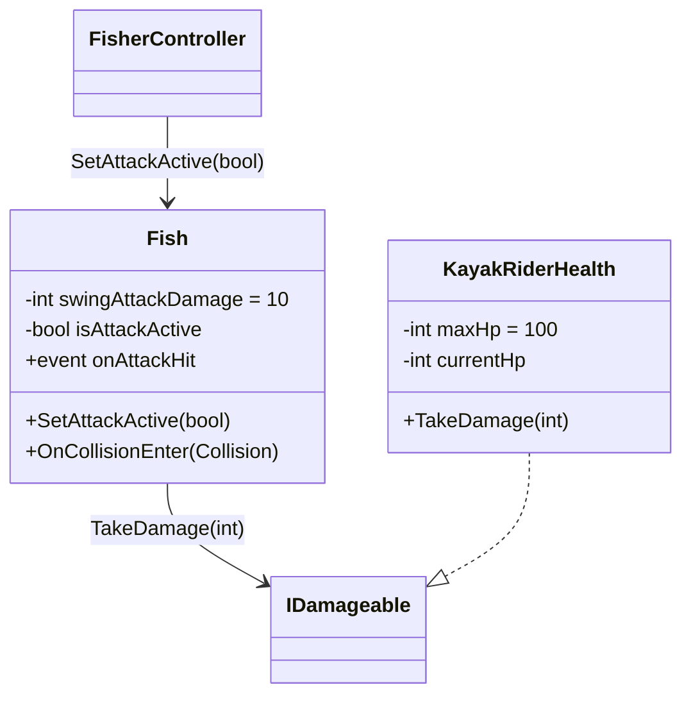

# 05_AttackSpec (攻撃システム仕様)

> 釣り人が捕獲した魚を振り回し、相手チームのカヤック乗りにダメージを与える「振り回し攻撃（Swing Attack）」の現状の実装仕様。
> 関連 Issue: [#4](https://github.com/guriguri00451/alounity/issues/4)

## 1. 概要

釣り人は魚を釣った後、`Swinging` 状態でスマホを振ることで魚を振り回し、衝突した相手カヤック乗りにダメージを与える。攻撃判定は `Swinging` 状態の間だけ有効になり、状態を外れると自動的に無効化される。

## 2. 状態遷移と攻撃の有効/無効

`FisherController` が `Idle → Waiting → Catching → Swinging → Idle` のサイクルを管理する。

| 遷移 | トリガー |
|------|---------|
| `Waiting → Catching` | 魚がヒット（`Hook.onFishSpawned`） |
| `Catching → Swinging` | Shake入力（振る動作）が `CatchRequiredShakeCount`（12回）に到達 |
| `Swinging → Idle` | 振り回し攻撃が `DropRequiredShakeCount`（5回）に到達 |

`Swinging` 状態に入ると `caughtFish.SetAttackActive(true)` で攻撃判定がONになり、`Swinging` から離脱すると `SetAttackActive(false)` でOFFになる。
([FisherController.cs:106-134](../Assets/alounity/contributors/soma/Scripts/Fisher/FisherController.cs#L106-L134))

## 3. 攻撃の発生条件・連続攻撃制御

- 入力: `FishRumbleInput` の `Player.Shake` アクション（スマホの振り動作 / デバッグ時は Space キー）
- `Swinging` 状態中に Shake が入ると `SwingAttack()` が呼ばれる ([FisherController.cs:152-158](../Assets/alounity/contributors/soma/Scripts/Fisher/FisherController.cs#L152-L158))
- `SwingAttack()` の処理 ([FisherController.cs:176-192](../Assets/alounity/contributors/soma/Scripts/Fisher/FisherController.cs#L176-L192)):
  1. `ShortenLine()` で `lineSpringJoint.maxDistance` を 0.5 ずつ短縮（下限 0.5）
  2. 前回の振りから `swingTimeoutSeconds`（1秒）以上空いていたら `swingCount` をリセット
  3. `swingCount` をインクリメント。`DropRequiredShakeCount`（5回）に達したら `Swinging → Idle` に遷移し、魚を落とす

## 4. ダメージ判定（Hitbox）

ダメージ判定は魚オブジェクト側の `Fish.OnCollisionEnter` で行われる。
([Fish.cs:43-53](../Assets/alounity/contributors/soma/Scripts/Fisher/Fish.cs#L43-L53))

判定条件（すべて満たす必要あり）:
1. `isAttackActive == true`（`Swinging` 状態中のみ）
2. 衝突相手のタグが `KayakRider`
3. 衝突相手が `IDamageable` を実装している

成立時: `target.TakeDamage(swingAttackDamage)` でダメージを与え、`onAttackHit` イベントを発火する。

### Hitbox の形状（`Fish.prefab`）

| 項目 | 値 |
|------|-----|
| Collider | `SphereCollider`, radius = 0.5, `isTrigger = false` |
| Rigidbody | `isKinematic = true`, `useGravity = false`（SpringJoint で牽引される） |
| `swingAttackDamage` | 10 |
| `maxDurability` | 10（針にかかった際の耐久値。`Fish.TakeDamage` で減算、現状アタック判定とは別経路） |

### Swinging 中の SpringJoint パラメータ（`FisherSpringJointConfig.asset`）

| 状態 | spring | damper | maxDistance | enableCollision |
|------|--------|--------|-------------|------------------|
| Idle | 10 | 0.05 | 1 | OFF |
| Waiting | 10 | 0.2 | 15 | OFF |
| Catching | 10 | 0.5 | 10 | OFF |
| **Swinging** | 10 | 0.8 | **5 → 振るたびに -0.5** | **ON** |

`Swinging` でのみ `enableCollision = 1` となり、魚と他オブジェクトとの衝突判定が有効になる点に注意。

## 5. ダメージ受け側

`KayakRiderHealth` が `IDamageable` を実装し、ダメージを受ける。
([KayakRiderHealth.cs](../Assets/alounity/contributors/soma/Scripts/KayakRiderHealth.cs))

```csharp
public void TakeDamage(int damage)
{
    currentHp = Mathf.Max(0, currentHp - damage);
}
```

- `maxHp`: 100（デフォルト）
- HP は 0 未満にならない
- 現状 HP 0 になったときの「死亡」演出（ラグドール化など）は未実装（[01_GameDesign.md](01_GameDesign.md) のルールに準拠予定）

## 6. クラス関係図



## 7. 未実装・要検討事項

- HP 0 時の死亡演出（ラグドール挙動切り替えなど）
- ヒットエフェクト（パーティクル・SE）の発火フック（`Fish.onAttackHit` を購読する処理が未実装）
- `maxDurability` / `Fish.TakeDamage(int damage = 1)`（針にかかった際の耐久値）と振り回し攻撃ダメージの関係性の整理
