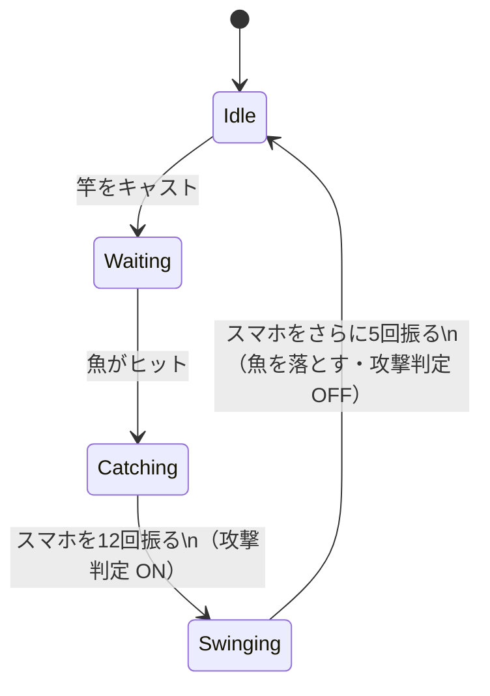

# 振り回し攻撃（Swing Attack）仕様 — チーム共有版

> 釣り人が魚を振り回して相手にダメージを与える「振り回し攻撃」の仕様をまとめたドキュメントです。  
> 開発者向けの詳細仕様は [05_AttackSpec.md](05_AttackSpec.md) を参照してください。

---

## どんな攻撃？

釣り人が魚を釣った後、振り回し状態（Swinging）でスマホを振ると **回転切り** を繰り出します。  
回転切りは自分を中心とした **円形の範囲攻撃** で、振った強さが強いほど攻撃半径が大きくなります。  
範囲内にいる相手チームのカヤック乗りにぶつかると **ダメージ10** を与えます。

---

## 攻撃までの流れ

```
① 待機（Idle）
      ↓ 魚がヒットする
② 釣り中（Catching）
      ↓ スマホを12回振る
③ 振り回し中（Swinging）← スマホを振るたびに回転切りが発動！
      ↓ さらに5回振る
④ 待機に戻る（Idle）＋ 魚を落とす
```

> **ポイント：** 攻撃判定が有効なのは「振り回し中（Swinging）」の間だけです。  
> 釣り中や待機中に振っても、回転切りは発動しません。

---

## 操作方法

| フェーズ | 操作 | 回数 |
|----------|------|------|
| 魚を引き上げる（Catching） | スマホを縦に振る | 12回 |
| 回転切りを発動（Swinging中） | スマホを振る | 振るたびに発動 |
| 攻撃を終了する | さらに振る | 5回 |

> デバッグ時（Unity Editor 上）は **Space キー** で振る動作を代替できます。

---

## ダメージ判定のしくみ

回転切り発動時、以下の **3つすべて** を満たした場合にダメージが入ります。

1. 振り回し中（Swinging）の状態である  
2. 攻撃半径内に「カヤック乗り（KayakRider）」がいる  
3. 相手がダメージを受けられる状態にある

満たしていた場合 → **相手の HP を 10 削る**

---

## 攻撃半径のしくみ

スマホを振った強さ（加速度）に応じて、回転切りの攻撃半径が変化します。

| 振りの強さ | 攻撃半径 |
|-----------|---------|
| 弱い | 小さい |
| 強い | 大きい |

> 具体的な換算値（加速度 → 半径）は調整中（TBD）。

---

## 数値まとめ

| 項目 | 値 |
|------|-----|
| 魚を引き上げるのに必要な振り回数 | 12回 |
| 攻撃を終了するのに必要な振り回数 | 5回 |
| 1回のヒットで与えるダメージ | 10 |
| 相手カヤック乗りの最大 HP | 100 |
| 振りをリセットする無操作時間 | 1秒 |
| 攻撃半径の最小値 | TBD |
| 攻撃半径の最大値 | TBD |

---

## 振り回し中の魚の動き

- 振り回し中にスマホを振ると、魚が自分を中心に **円を描くように回転** します。
- 円の半径はそのときの **振りの強さ** によって決まります。
- 振り回し中だけ攻撃の **円形範囲判定がON** になります。

---

## 現在 未実装の部分

| 項目 | 状況 |
|------|------|
| HP が 0 になった時の演出（倒れる・落ちるなど） | 未実装 |
| 攻撃ヒット時のパーティクル・効果音 | 仕組みは用意済み、再生処理が未接続 |
| 魚の種類ごとのダメージ差異 | 未実装（現状は固定値 10） |

---

## 状態の関係図


